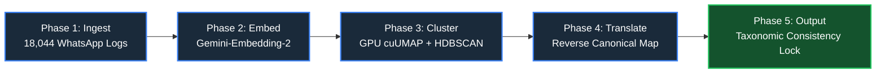

<a href="https://ai-socialimpact.github.io/ReliableAnsweringExperience/Approach/index"> Back to index page </a>

# 🏗️   FAQ Automation Pipeline

An automated data-engineering and AI-driven pipeline designed to convert unstructured, multi-dialectal community conversation logs into a structured, taxonomically consistent, and production-ready FAQ knowledge base.

---

## 🗺️ The 5-Phase  Workflow

### 📥 Phase 1: Ingest (The Raw Community Feed)
* **The Problem (Challenge 1):** Inbound message streams arrive as highly unstructured, colloquial conversational text. This data footprint consists of **18,044 raw community questions** extracted directly from the **Glific Question Log**.
* **The Executive Reality:** The channel logs are flooded with phonetic Hinglish variations, conversational greeting words (*"hello"*, *"sir"*), text shortcuts, and localized spelling mutations. This conversational friction makes traditional, rigid keyword filters or rule-based matching entirely prone to misinterpretation. 
* *Note: Phase 1 focuses entirely on capturing this raw user demand; there is no software cleanup or filtering at this entry funnel.*

### 📐 Phase 2: Embed (The Multilingual Semantic Translation Layer)
* **The Mechanics:** Chunks and pipes the raw text blocks directly into the high-resolution `gemini-embedding-2` infrastructure to build a dense, 3,072-dimensional coordinate space matrix.
* **The Architectural Rationale:** Traditional data tools fail when processing unstructured slang. This phase functions as a one-time semantic translation engine. It bypasses spelling errors to map the true underlying medical meaning into mathematical geometries. These coordinate matrices are saved directly to local storage (`.npy`), allowing the system to reuse them for hundreds of analytical runs while completely bypassing repetitive cloud API costs.

### 📊 Phase 3: Cluster (Topological Intention Isolation)
* **The Problem (Challenge 2):** There are infinite ways to partition a high-dimensional vector space. Arbitrary or poorly tuned mathematical splits cause semantic bleed, blending unrelated domains together and confusing the automation system.
* **The Solution:** The pipeline executes a **12-iteration hyperparameter tuning network grid search** in under 10 minutes. It optimizes natively for the *Relative Validity Index (RVI)* to ensure topic folders are dense enough to hold core information but distinct enough to guarantee zero category overlap. (For instance, it isolates *Vaccine Schedules* into one folder while locking *Vaccine Side Effects* into a separate lane). The winning run successfully uncovers **419 fine-grained micro-intent topic entries** while filtering out background noise.

### 🧠 Phase 4: Translate (Reverse Canonical LLM Consensus Mapping)
* **The Problem (Challenges 3 & 4):** NGO panels operate under strict operational time constraints (e.g., a 3-day vetting window). Machine-readable cluster IDs (`Cluster #44`) make no sense to humans, and forcing doctors to read through 500 near-identical lines inside a folder results in immediate cognitive overload and execution delays.
* **The Solution:** A local payload factory engine uses pairwise cosine geometry to select a balanced data slice from each folder—capturing the top 10 heavy repeaters (volume weight) and merging them with 20 distinct outliers (meaning diversity). It passes this clean context block to `gemini-2.5-pro`, running a reverse canonical mapping routine that collapses abstract vector points into clear, brief, human-intelligible summary sentences and canonical title entries.

### 🗃️ Phase 5: Output (The Taxonomic Consistency Lock)
* **The Problem (Challenge 6):** Because LLMs are inherently stateless across sequential generation loops, a naive, unguided batch pipeline will constantly invent entirely new, conflicting terminology and disorganized taxonomies for adjacent rows. This structural drift results in a fragmented booklet that is incredibly difficult for humans to read and breaks downstream chatbot lookup accuracy.
* **The Solution:** Phase 5 enforces **Taxonomic Consistency Across Every Single Pass**. The loop uses an advanced Pydantic type validator while streaming an officially approved, consistent domain taxonomy index directly into the prompt context window. This forces the LLM to follow rigid classification boundaries on every row pass. The engine flattens nested arrays into clean text lists, exporting a production-grade spreadsheet database complete with **What User Are Asking** broad summaries, **Top Canonical FAQ Questions**, and cross-lingual search meta-tags.

---

## 📋 Executive Design Decision Matrix

| Workflow Phase | Targeted Problem Area | Strategic Rationale & Solution | Downstream Business Benefit |
| :--- | :--- | :--- | :--- |
| **Phase 1: Ingest** | 18,044 raw community questions from the Glific log containing spelling errors and mixed dialects. | Pure entry funnel to capture raw, decentralized community demand. | Explicit data baseline tracking real-world user anxieties. |
| **Phase 2: Embed** | Inability of traditional keyword matching to parse Hinglish or conversational slangs. | One-time translation into a high-res 3,072-D dense vector matrix. | Eliminates text chaos; cuts recurring API token costs by saving coordinates to disk. |
| **Phase 3: Cluster** | Arbitrary clustering splits; danger of mixing critical separate topics like schedules vs side effects. | GPU-accelerated grid search auto-tuned to lock down 419 distinct intent islands. | Eliminates category overlap; protects chatbot from misinterpreting similar folders. |
| **Phase 4: Translate** | Tight NGO review deadlines (3 days); reading 500 questions per cluster causes human overload. | Reverse canonical LLM mapping over a balanced volume/diversity text slice. | Compresses machine data into intuitive, executive-ready question summaries. |
| **Phase 5: Output** | Stateless semantic drift; AI inventing random, conflicting taxonomies for adjacent booklet rows. | **Taxonomic Consistency Lock:** Enforces a rigid pre-approved reference index across every pass. | Guarantees a perfectly unified booklet structure; enables seamless vector search lookups. |

---
 
